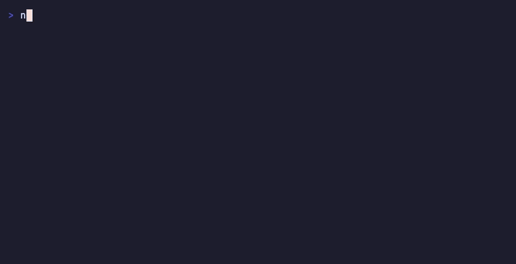

# secretless-ai

[](./STATUS.md)

> **[OpenA2A](https://github.com/opena2a-org/opena2a)**: [CLI](https://github.com/opena2a-org/opena2a) · [HackMyAgent](https://github.com/opena2a-org/hackmyagent) · [Secretless](https://github.com/opena2a-org/secretless-ai) · [AIM](https://github.com/opena2a-org/agent-identity-management) · [Browser Guard](https://github.com/opena2a-org/AI-BrowserGuard) · [DVAA](https://github.com/opena2a-org/damn-vulnerable-ai-agent)

Keep API keys and other secrets invisible to AI coding tools. Works with Claude Code, Cursor, GitHub Copilot, Windsurf, Cline, and Aider. Apache 2.0.

[](https://www.npmjs.com/package/secretless-ai)
[](LICENSE)
[](https://github.com/opena2a-org/secretless-ai/actions/workflows/ci.yml)

[Website](https://opena2a.org/secretless) · [Demos](https://opena2a.org/demos) · [Discord](https://discord.gg/uRZa3KXgEn)

## Quick start

```bash
npx secretless-ai init
```

```
  Secretless v0.23.1
  Keeping secrets out of AI

  Configured: Claude Code (1 of 1 detected)

  Created:
    + .claude/hooks/secretless-guard.sh
    + .claude/hooks/secretless-output-check.cjs
    + CLAUDE.md

  Modified:
    ~ .claude/settings.json (added 99 deny patterns)

  Next steps:
    Verify: secretless-ai verify
    Scan:   secretless-ai scan
    Status: secretless-ai status
```



## Install

### npm

```bash
npx secretless-ai init          # run once, no install
npm install -g secretless-ai    # install globally
```

Requires Node.js 20.19 or later.

### Homebrew

```bash
brew install opena2a-org/tap/secretless-ai
```

### From source

```bash
git clone https://github.com/opena2a-org/secretless-ai.git
cd secretless-ai
npm install
npm run build && npm test
node dist/cli.js verify
```

### Verifying what was installed

Every release publishes via npm Trusted Publishing with SLSA v1 provenance. No long-lived `NPM_TOKEN`. GitHub Actions exchanges its OIDC token with npm at publish time.

```bash
npm view secretless-ai dist.attestations --json
# Expects non-empty result with predicateType "https://slsa.dev/provenance/v1"
```

Secretless never reads or transmits credential values it manages. Backends (OS keychain, 1Password, HashiCorp Vault, GCP Secret Manager, AES-256-GCM encrypted file) decrypt on demand at subprocess spawn time. `secretless-ai verify` runs an integrity check of your local install.

## How it works

1. **Scans** your project for hardcoded credentials in source files, key files, and the config files it recognizes by name; a directory scan does not open other files, such as `values.yaml` or `main.tf` (see [Incomplete scans do not report clean](#incomplete-scans-do-not-report-clean)), and naming a file scans it: `npx secretless-ai scan deploy/values.yaml`. 57 credential patterns from [`@opena2a/credential-patterns@0.1.3`](https://www.npmjs.com/package/@opena2a/credential-patterns), lockstep-asserted. Suppresses fixture-path false positives via `.secretlessignore` defaults (`test/`, `__tests__/`, `examples/`, `e2e/`, `docs/vhs/`, `node_modules/`, etc.).
2. **Migrates** them to secure storage: OS keychain, 1Password, HashiCorp Vault, GCP Secret Manager, or AES-256-GCM encrypted file.
3. **Gates** AI-tool reads of credential files. 18 file patterns enforced as Claude Code deny rules, plus a PreToolUse hook that denies tool calls that would read credential files or expose secrets before they run: a gate on the assistant's tool path, not a security boundary around the machine. Other tools get instruction files or ignore patterns (see [Supported tools](#supported-tools)).
4. **Brokers** access through environment variables. Stored values never enter AI context; a command whose own output is a credential is the one channel no layer blocks. In Claude Code a PostToolUse check warns after such a command runs (see [What the guard cannot see](#what-the-guard-cannot-see)).

## Store secrets and use them in AI sessions

Move keys out of files and into a storage backend, then use them by name. Values never enter AI context, transcripts, or shell history.

```bash
npx secretless-ai secret set STRIPE_SECRET_KEY --from-clipboard   # key copied from a web page
npx secretless-ai secret set STRIPE_SECRET_KEY   # or type or paste it at a prompt, input hidden
npx secretless-ai import .env                    # or migrate an existing .env in one step
npx secretless-ai secret list                    # names only, values are never printed
```

`--from-clipboard` is the recommended way to store a key copied from a web dashboard. It reads the clipboard through `pbpaste` (macOS), `wl-paste`, `xclip` or `xsel` (Linux) or `Get-Clipboard` (Windows), so the value never appears on the command line, the screen or in shell history, and it prints only the value's length and character classes. After storing it, it clears the clipboard, unless the clipboard changed since it was read or `--keep-clipboard` is given. An empty clipboard or a missing clipboard tool stores nothing and exits 1. `secret set NAME=VALUE` puts the value in shell history, and `pbpaste | secret set NAME` leaves it in the clipboard.

`secret set` also installs a shell hook (`eval "$(secretless-ai env)"` in `~/.zshenv` or `~/.bashrc`), so new terminals export stored secrets as environment variables automatically. To inject into a single command instead of the whole shell:

```bash
npx secretless-ai run --only STRIPE_SECRET_KEY -- node charge.js
```

The command reads the value from its environment. `run` refuses to start a command whose arguments carry a stored value of eight or more characters, verbatim or URL-encoded, because `ps` shows a process's arguments to every local process; for `psql`, store the password as `PGPASSWORD` and pass host, user and database as arguments. `--allow-argv` starts it anyway, with a warning.

Reading a value back is TTY-gated: `secret get NAME` prints it in an interactive terminal, but is blocked in piped or AI-driven contexts unless `--force` is passed — and `init` installs deny rules so AI tools cannot run the `--force` form or dump an injected environment (`run -- env`).

### Record what a credential is for

A value alone does not say which app it belongs to or what it may do. `secret set` takes a description and repeatable `--meta key=value` fields, and `secret show` reads them back without the value:

```bash
npx secretless-ai secret set LINKEDIN_CLIENT_SECRET \
  --description "Client secret, marketing agent app" \
  --meta provider=linkedin --meta app=marketing_agent \
  --meta scopes=r_basicprofile,w_member_social --meta tokenTtl=5184000
npx secretless-ai secret show LINKEDIN_CLIENT_SECRET      # description and metadata, never the value
npx secretless-ai secret list --long --app marketing_agent  # every entry recorded for one app
```

Descriptions and metadata are not secrets. They are kept in plain text beside the store (`~/.secretless-ai/secret-annotations.json`) and printed by `secret show` and `secret list --long`; neither command prints a value, and neither is blocked by the deny rules `init` installs. `set` refuses a description or field that contains the value or looks like a credential. Keys are free-form; `app`, `provider`, `scopes`, `tokenTtl`, `redirectUri` and `expiresAt` are conventions, not a schema. `--meta key=` removes a field, `set` without either flag keeps what was recorded, and `secret rm` removes both. `secret list --json` and `secret show --json` include the same fields.

### Move secrets to another machine

A keychain or local store cannot be copied as a file. `export` writes the stored secrets into one bundle encrypted with a passphrase (scrypt, AES-256-GCM); `import` on the other machine stores them in that machine's backend:

```bash
npx secretless-ai export --out team.secretless-bundle            # add --only K1,K2 for a subset
npx secretless-ai import team.secretless-bundle                  # on the other machine
```

The passphrase is asked for in the terminal, or read from `SECRETLESS_EXPORT_PASSPHRASE`; it is never accepted as an argument, and no value is printed. `import` writes nothing when the passphrase is wrong or a name already exists (`--force` replaces it), then reads each name back from the store and reports whether all of them resolve. The bundle also carries the `required` flag and description from the exporting project's `.secretless`. `scan` and `scan-staged` flag a `*.secretless-bundle` file, `clean` redacts a bundle printed into a transcript, and `verify` fails while one is in a recent transcript. Delete the bundle on both machines once it is imported. `export` refuses to run inside an AI agent session.

### Track an exposed key until it is rotated

Redacting a transcript does not revoke a key. When a stored value has been pasted into a chat, shown on screen or committed, record it, and the record stays open until the stored value changes:

```bash
npx secretless-ai secret exposed OPENAI_API_KEY --where "pasted into a chat"   # --at 2026-10-07 for an earlier date
npx secretless-ai secret list --needs-rotation          # exits 1 while any exposure is open (--json for CI)
npx secretless-ai secret set OPENAI_API_KEY             # the new value from the provider closes it
```

The record is `exposedAt` and `exposedWhere` in the secret's metadata, never the value. `secret set` compares the new value with the stored one in memory: a different value closes the exposure and records `rotatedAt`; the same value leaves it open and says so. When `clean` or `watch` redacts a value equal to a stored secret, it marks that secret exposed and prints its name and the next step. `status` shows the open count.

### Give git a stored token over HTTPS

A hosting token in `~/.git-credentials` or `~/.netrc` sits on disk in plaintext. `doctor` and `status` report those files (count and line numbers, never values) and a `credential.helper` set to `store`, each with Verify and Fix lines. To keep the token in the store and let git read it from there:

```bash
npx secretless-ai secret set GITHUB_TOKEN
npx secretless-ai git-credential install --host github.com --name GITHUB_TOKEN   # [--username <user>]
npx secretless-ai git-credential uninstall --host github.com                     # removes only what install added
```

`install` adds two entries to `credential.https://github.com.helper` in the global git config: an empty one, which stops git asking any helper configured before it (such as `store`) for that host, and the helper itself. No value is written to any config file. Git runs the helper as `git-credential get`, which answers only HTTPS requests for its host and refuses when stdin or stdout is a terminal; `store` and `erase` write nothing. `init` blocks an AI tool from running `git-credential get` or `git credential fill`, which would print the token.

### Ask your AI assistant to use a secret

After `init`, the assistant's instruction file (`CLAUDE.md`, `.cursor/rules/secretless.mdc`, ...) lists which keys are available as environment variables and tells the tool to reference them as `$VAR_NAME` without reading values. So this works in Claude Code:

> Call the Stripe API and list the last 5 charges.

Claude writes the command with a variable reference. The shell substitutes the value inside the subprocess; nothing enters the model's context:

```bash
curl -s "https://api.stripe.com/v1/charges?limit=5" -H "Authorization: Bearer $STRIPE_SECRET_KEY"
```

For a key stored after `init`, or one `init` doesn't recognize, name the variable in your prompt ("use `$GAMMA_API_KEY` for auth") or add a row to the key table in `CLAUDE.md`. To keep the assistant away from raw values entirely, ask it to run commands under the injector:

> Run the deploy script with `secretless-ai run --only DEPLOY_TOKEN -- ./deploy.sh`.

### What the guard cannot see

The hook and the deny rules check a command before it runs, by its text and the local paths it names. Neither can see what the command prints. A command that returns credential values (`aws secretsmanager get-secret-value`, `kubectl get secret -o yaml`, a provider API that returns keys or environment variable values) puts them into the model's context, and nothing in Secretless blocks it. `init` tells the assistant not to run such commands and to read only named, non-secret fields. That is an instruction, not an enforced control.

In Claude Code, `init` also installs a PostToolUse hook (`.claude/hooks/secretless-output-check.cjs`) that reads each Bash command's output after it runs. When the output matches a pattern in the credential catalog, the hook warns you and tells the assistant to treat the value as exposed. It names the pattern and never repeats the value. This is detection after exposure, not prevention: the value is already in context when the hook sees it, and a credential format outside the catalog passes unflagged. If it fires on a live credential, rotate it; `npx secretless-ai clean` redacts saved transcripts.

## MCP server protection

Every MCP server config has plaintext API keys in JSON files on your machine. The LLM sees them. Secretless encrypts them.

```bash
npx secretless-ai protect-mcp
```

```
  Scanned 1 client(s)

  + claude-desktop/browserbase
      BROWSERBASE_API_KEY (encrypted)
  + claude-desktop/github
      GITHUB_PERSONAL_ACCESS_TOKEN (encrypted)
  + claude-desktop/stripe
      STRIPE_SECRET_KEY (encrypted)

  3 secret(s) encrypted across 3 server(s).
  MCP servers start normally. No workflow changes needed.
```

Scans configs across Claude Desktop, Cursor, Claude Code, VS Code, and Windsurf. Secrets move to your configured backend. Non-secret env vars (URLs, regions) stay untouched.

```bash
npx secretless-ai protect-mcp --backend 1password   # store MCP secrets in 1Password
npx secretless-ai mcp-status                        # show which servers are protected
npx secretless-ai mcp-unprotect                     # restore original configs from backup
```

## Triage helpers

```bash
npx secretless-ai scan --min-confidence 0.85   # high-confidence findings only
npx secretless-ai scan --max-files 20000       # raise the per-walk file cap (default 5000)
npx secretless-ai ignore docs/migration.md     # append a path to .secretlessignore
npx secretless-ai ignore --pattern '*.golden.txt'
npx secretless-ai diff main                    # audit secretless-managed file changes vs a git ref
npx secretless-ai scan --json                  # machine-readable findings for CI
npx secretless-ai status --json                # protection state for CI (gate on summary.verdict)
```

`scan` renders a `Confidence: high (0.92)` line under every finding. The score combines pattern specificity, value entropy, value length, and path tier. With `--no-ignore`, findings whose path matches the default-ignore list are tagged `(looks like a test fixture)` so they stay visible without being re-suppressed.

### Incomplete scans do not report clean

A scan that could not read everything is not a passing scan. If the walk stops at the file cap, or a path cannot be opened, `scan` prints what it missed, exits 1, and says `No credentials found in the files scanned` rather than `No hardcoded credentials found`. In `--json`, `summary.truncated` and `summary.unreadable` carry the same signal, so CI can tell "clean" from "unfinished".

**Two kinds of gap, and only one of them gates.** A gap against a claim the scanner made -- it said it would read something and did not -- sets exit 1: `truncated`, `unreadable`, `oversize`. A boundary the scanner declared and never claimed to cross does not: `outOfRoot`, `skippedUnsupported` (files enumerated but not opened, such as a `.png` or a `.md`), `notEntered` (directories not descended into, such as `node_modules/` or any dot-directory), and `unscannedConfig` (config-format files whose names are not on the built-in list, such as `secrets.json`, `.npmrc` or `values.yaml`; `scan --include-config` reads them). The second group is reported, sampled and given the command that scans it, but it does not fail your build -- every repository contains at least one of them, so gating on it would fail every build. If you want a declared boundary to gate, test it yourself: `jq -e '.summary.notEntered == 0'`.

A directory scan checks source files by extension (`.js`, `.ts`, `.py`, `.go`, `.java`, `.rb`, and others), key files (`.pem`, `.key`, `.crt`, `.p12`, `.pfx`), and the config files it recognizes by name (`.env` files other than templates such as `.env.example`, `config.json`, `package.json`, `CLAUDE.md`, MCP client configs, `docker-compose.yml`, and others); the full source extension and config name lists are in [`src/patterns.ts`](https://github.com/opena2a-org/secretless-ai/blob/main/src/patterns.ts). It does not open other files, such as `values.yaml`, `main.tf`, `.ipynb` notebooks, or most GitHub Actions workflows and `.md` files. It also checks these AI tool configs in your home directory: `~/.claude/CLAUDE.md`, `~/.claude/settings.json`, `~/.claude.json`, and `~/.cursor/mcp.json`.

Dot-directories are among the `notEntered` group, and that includes `.claude/`. Inside them, key files and the config files the scan recognizes by name are still scanned; source files and other files are not. See issue #144.

Symlinks are followed inside the scan root. A link whose target resolves outside it is not followed -- otherwise a repo containing `link -> $HOME` would pull the whole home directory into the scan -- and each one is listed with the command to scan its target directly, so the boundary is never silent. These do not affect the exit code.

### A flag never widens scope

A command line the tool cannot bind is refused with exit 2 before anything runs, rather than partly ignored. That covers an unrecognised flag, a flag given a value it cannot use, and a value-taking flag given no value at all. `--only=NAME`, `--path=DIR` and every other `--flag=value` spelling binds the same way as the spaced form.

`scan`, `scan-staged` and `scan-history` refuse an unrecognised flag rather than warning and continuing, because their output is the answer: a typo in a coverage flag used to produce `No hardcoded credentials found.` at exit 0 over a narrower scan than the one you asked for. `feedback` and `diff` still warn, since they report no verdict.

`--json` is implemented by `scan`, `status`, `secret list` and `secret show`. Passing it to any other command exits 2 and names the commands that implement it, rather than printing human text and exiting 0 -- the caller of `--json` is a machine, and a machine reading exit 0 beside prose cannot tell it was ignored.

Exit codes: `0` clean, `1` credentials found (or an incomplete scan), `2` the command line was refused and nothing ran. Gate CI on `2` separately -- it means the tool did not answer the question, not that the answer was clean.

```bash
npx secretless-ai clean --dryrun --path ./transcripts
#   Unknown option: --dryrun (did you mean --dry-run?)
#   `clean` was not run. Nothing was changed.
#   Supported: --dry-run, --help, --last, --path <value>
#   Run `secretless-ai clean --help` for usage.
```

```bash
npx secretless-ai scan --json | jq '.summary'
# { "total": 0, "critical": 0, "high": 0, "placeholdersSuppressed": 0,
#   "minConfidence": 0, "confidenceSuppressed": 0, "truncated": false, "maxFiles": 5000, "unreadable": 0, "outOfRoot": 0,
#   "oversize": 0, "skippedUnsupported": 0, "notEntered": 0,
#   "unscannedConfig": 0 }
```

## Architecture

Three layers. Use one, two, or all three. Each works against any supported backend.

**Tier 1: In-process SDK.** Credentials resolved in the call stack and zeroized after use. Available in the Python and TypeScript AIM SDKs. Sub-millisecond overhead.

**Tier 2: Vault Exec.** Runs one command with a vault credential set in that command's environment. Vault Exec does not export the value to the calling shell, pass it on the command line, or write it to a file.

```bash
npx secretless-ai vault exec github -- curl https://api.github.com/user
```

The child process receives the value as `$GITHUB` and holds it in its environment for as long as it runs. Vault Exec does not mask the child's output: whatever the command prints goes to whoever ran it, so when an AI assistant runs a wrapped command that prints its environment or the credential, the value enters the assistant's context (see [What the guard cannot see](#what-the-guard-cannot-see)). While the child runs, another process running as the same user can read its environment. Wraps any command, in any language.

**Tier 3: Broker with identity policy.** A local daemon that mediates credential access across multiple agents. Policy rules allow or deny access by agent ID, credential name, time window, and rate limit. Optional AIM integration adds trust-score and capability constraints.

```bash
npx secretless-ai broker start
```

See [Run the Broker](docs/use-cases/run-broker.md) for when to use the daemon and how to configure it.

AIM is optional. Tier 1 and Tier 2 work against any of the five [storage backends](#storage-backends) with no AIM involvement. Tier 3 adds identity-bound policy when an AIM server is reachable. Default-deny still enforces locally without one.

## Supported tools

| Tool | Protection method |
|---|---|
| Claude Code | PreToolUse hook (`secretless-guard.sh`, a gate on the assistant's tool path: denies tool calls that would read credential files or expose secrets, before they run) + PostToolUse output check (`secretless-output-check.cjs`, warns after a Bash command prints a credential-shaped value; detection, not prevention) + deny rules + CLAUDE.md |
| Cursor | `.cursor/rules/secretless.mdc` instructions |
| GitHub Copilot | `.github/copilot-instructions.md` instructions |
| Windsurf | `.windsurfrules` instructions |
| Cline | `.clinerules/secretless.md` instructions |
| Aider | `.aiderignore` file patterns |

Claude Code gets the strongest protection because it supports [hooks](https://code.claude.com/docs/en/hooks). Hook commands run before the assistant's tool calls and can deny them: a gate on the assistant's tool path, not a security boundary against other processes on the machine.

For Cursor, GitHub Copilot, Windsurf and Cline, Secretless writes an instruction file: nothing enforces it, and it has no effect unless the tool loads that file. The table shows the file `init` creates in a project with no rule file yet. `init` never creates a `.cursorrules` file or a single-file `.clinerules`; where a project already has one, the block is appended to it. A Cursor project whose rules live only in `.cursorrules` gets no `.mdc` file, and a Cline project with a `.cline/rules/` directory and no `.clinerules` gets `.cline/rules/secretless.md`.

## Storage backends

| Backend | Storage | Best for |
|---|---|---|
| `local` | AES-256-GCM encrypted file | Quick start, single machine |
| `keychain` | macOS Keychain or Linux Secret Service | Native OS integration |
| `1password` | 1Password vault | Teams, CI/CD, multi-device |
| `vault` | HashiCorp Vault KV v2 | Enterprise, self-hosted |
| `gcp-sm` | GCP Secret Manager | GCP-native workloads |

```bash
npx secretless-ai backend set 1password               # switch backend
npx secretless-ai migrate --from local --to 1password # migrate existing secrets
```

To seed a new machine from a team's shared backend, `secret sync` copies the names a project's `.secretless` manifest requires (or the names given with `--only K1,K2`) into this machine's store. It prints names only, and leaves a local value that differs as it is unless `--force` is given:

```bash
npx secretless-ai secret sync --from 1password --dry-run  # created / updated / left alone, nothing written
npx secretless-ai secret sync --from 1password            # copy the required names of ./.secretless
npx secretless-ai setup --check                           # confirm nothing required is missing
```

To put a stored secret into a deployment, `secret push` writes it to a cloud secret store. Each value goes from this machine's store into an HTTPS request body, never onto a command line, and the output carries names, identifiers and versions only. Key Vault secret names allow letters, digits and `-`, so `--as` gives the name to use there:

```bash
npx secretless-ai secret push OPENAI_API_KEY --to azure-kv --vault kv-prod --as OPENAI-API-KEY --dry-run  # would create / would add a version
npx secretless-ai secret push OPENAI_API_KEY --to azure-kv --vault kv-prod --as OPENAI-API-KEY            # prints the secret URI and version
az containerapp secret set -n <app> -g <rg> \
  --secrets openai-api-key=keyvaultref:https://kv-prod.vault.azure.net/secrets/OPENAI-API-KEY,identityref:<identity-id>
```

The Key Vault token comes from the standard Azure credential chain: `AZURE_TENANT_ID` and `AZURE_CLIENT_ID` with `AZURE_CLIENT_SECRET` or `AZURE_FEDERATED_TOKEN_FILE`, then a managed identity, then the signed-in Azure CLI. Pushing needs the Key Vault Secrets Officer role on the vault (or `set` in its access policy); the container app's identity needs Key Vault Secrets User to read the reference. `--to vault` and `--to gcp-sm` push to HashiCorp Vault and GCP Secret Manager the same way, at the names `secret sync --from` reads. A name that is not stored on this machine stops the push before anything is written, and the first write that fails stops the rest. `--dry-run` reads metadata only, so a write the target would refuse is found by the real run.

Set `SECRETLESS_OS_KEYCHAIN=off` to refuse every call to the macOS Keychain and Linux Secret Service CLIs; reads and writes through those backends then fail with an error instead of prompting, and nothing is read from or written to another store. The value is exactly `off`, in lowercase: `OFF`, `0` or `false` leave the OS keychain reachable.

## NanoMind integration

Optional integration with [NanoMind](https://github.com/opena2a-org/nanomind) for enhanced security analysis:

```bash
npm install @nanomind/guard @nanomind/engine  # optional
```

- **MCP injection screening.** `protect-mcp` screens env-var values for prompt-injection patterns and warns when suspicious content is detected.
- **Generated scan context.** `scan --explain` can add a model-written note beside each finding, off by default and enabled with `SECRETLESS_NANOMIND_EXPLAIN=1`. It is off because the local engine does not yet produce explanations worth showing: over 30 measured runs, none were usable and several asserted things about the credential that were not true. Verified remediation always comes from the finding itself, never from the model.

Both features gracefully degrade when NanoMind packages are not installed.

## Using with opena2a-cli

[`opena2a-cli`](https://github.com/opena2a-org/opena2a) is the unified CLI for the OpenA2A security toolchain. Secretless powers `opena2a secrets`.

```bash
npm install -g opena2a-cli
opena2a review          # full security dashboard
opena2a secrets init    # initialize secretless protection
```

## Telemetry

Secretless sends anonymous tier-1 usage data to the OpenA2A Registry: tool name (`secretless-ai`), version, command name (`scan`, `protect`, etc.), success, duration, platform, Node major version, and a stable per-machine `install_id`. No content is collected. No scanned secrets, no file paths, no env-var values, no rule contents, no IPs.

- Policy: [opena2a.org/telemetry](https://opena2a.org/telemetry).
- Status: `secretless-ai telemetry status`.
- Disable per-invocation: `OPENA2A_TELEMETRY=off secretless-ai <anything>`.
- Disable persistently: `secretless-ai telemetry off`.
- Audit every payload: `OPENA2A_TELEMETRY_DEBUG=print secretless-ai <anything>` echoes each event to stderr as JSON.

Fire-and-forget with a 2-second timeout. Telemetry never blocks Secretless.

## Use cases

| Guide | Time |
|---|---|
| [Protect My Credentials](docs/use-cases/protect-my-credentials.md) | 2 min |
| [Secure MCP Configs](docs/use-cases/secure-mcp-configs.md) | 3 min |
| [Bring Your Own Vault](docs/use-cases/bring-your-own-vault.md) | 3 min |
| [Run the Broker](docs/use-cases/run-broker.md) | 3 min |
| [Team Setup](docs/use-cases/team-setup.md) | 5 min |
| [Migrate from .env](docs/use-cases/migrate-from-dotenv.md) | 3 min |

Full index: [docs/USE-CASES.md](docs/USE-CASES.md).

## Contributing

Apache 2.0. PRs from outside the org welcome.

```bash
git clone https://github.com/opena2a-org/secretless-ai.git
cd secretless-ai && npm install && npm run build && npm test
```

Security issues: `info@opena2a.org` (coordinated disclosure, response within 24 hours).

## Links

- [Website](https://opena2a.org/secretless)
- [Documentation](https://opena2a.org/docs/secretless)
- [Demos](https://opena2a.org/demos)
- [OpenA2A CLI](https://github.com/opena2a-org/opena2a)
- [Credential patterns library](https://www.npmjs.com/package/@opena2a/credential-patterns)
- [aicomply](https://github.com/opena2a-org/aicomply) — inline PII and credential classification for agent I/O at runtime, the complement to protecting credentials at rest

Part of the [OpenA2A](https://opena2a.org) security platform.

## License

Apache-2.0. See [LICENSE](LICENSE).
